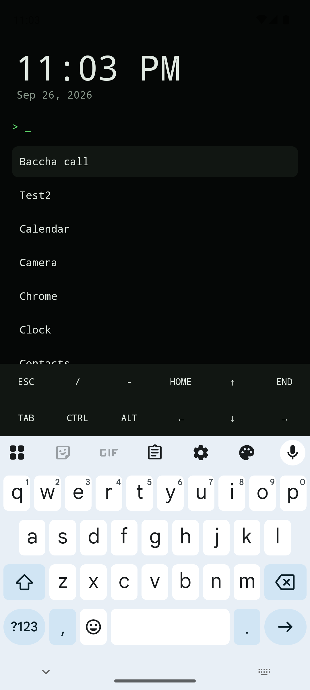
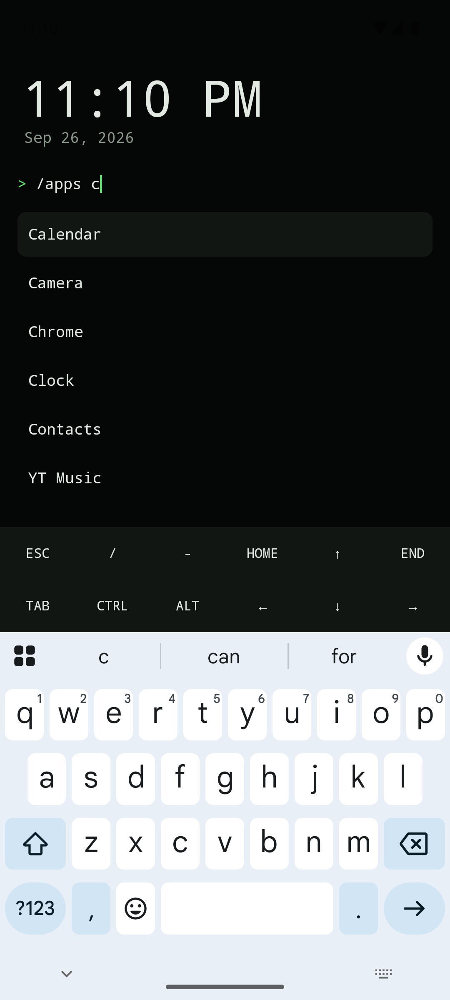
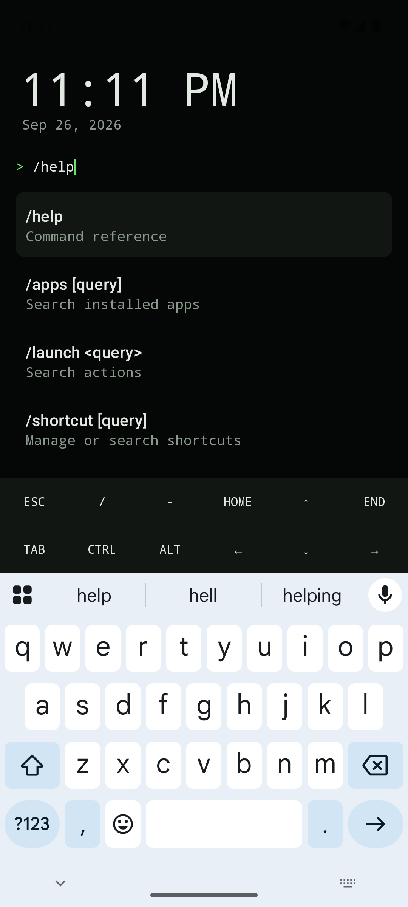
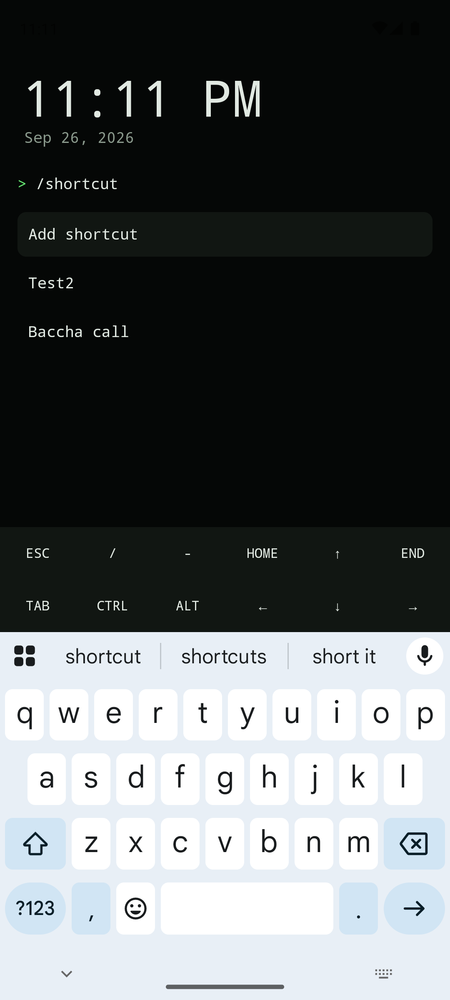

<div align="center">

# HomeDeck

### Your Android home screen, distilled to a command line.

[](https://developer.android.com/)
[](https://kotlinlang.org/)
[](https://developer.android.com/compose)

**Fast app launching · custom intent shortcuts · keyboard-first navigation**

</div>

---

HomeDeck is a minimal, searchable Android launcher for people who would rather type than hunt through grids of icons. Search apps and saved shortcuts from one prompt, or use slash commands when you want a narrower view.

```text
  09:41
  Friday, 26 September

  > /apps calc

    Calculator
```

## A candid warning

> [!CAUTION]
> **HomeDeck is a 100% vibe-coded app.** The author has not thoroughly verified or audited the code. Expect rough edges, review the source yourself, and use it at your own risk—especially before making it your default launcher.

## Screenshots

| Home | Apps-only search |
| :---: | :---: |
|  |  |
| **Command reference** | **Shortcut manager** |
|  |  |

## What it does

- Finds and launches installed apps with case-insensitive search.
- Creates reusable shortcuts for web pages, phone numbers, map locations, and custom Android intents.
- Filters results with focused slash commands.
- Supports keyboard and on-screen navigation controls.
- Opens app settings or the uninstall screen without leaving the launcher flow.
- Can register as the device's default Home app.

## Commands

| Command | Purpose |
| --- | --- |
| `/apps [query]` | Show only installed apps |
| `/launch <query>` | Search built-in launcher actions |
| `/shortcut` | Open the shortcut manager |
| `/shortcut <query>` | Search saved shortcuts |
| `/help` | Show the command reference |

Typing without a slash searches apps and saved shortcuts together.

## Controls

| Key | Action |
| --- | --- |
| `↑` / `↓` | Move through results |
| `→` | Open or continue |
| `←` / `Esc` | Go back |
| `Tab` | Complete the selected command |
| `Alt` + `D` | Uninstall the selected app or delete the selected shortcut |
| `Alt` + `E` | Edit the selected shortcut |
| `Alt` + `S` | Open settings for the selected app |

The same essentials are available through the extra-key row above the Android keyboard.

## Build it

You will need Android Studio with a compatible JDK and the Android 37 SDK.

```bash
git clone https://github.com/Pinaki93/HomeDeck.git
cd HomeDeck
./gradlew assembleDebug
```

Install the debug build on a connected device:

```bash
./gradlew installDebug
```

Then open HomeDeck and run `/launch default` to ask Android to make it the default Home app.

## Verify it

```bash
./gradlew testDebugUnitTest
./gradlew connectedDebugAndroidTest
```

The presence of tests does not replace a security review or thorough real-device testing. See the warning above.

## Stack

- Kotlin
- Jetpack Compose + Material 3
- Android ViewModel and saved state
- Plain JSON storage for shortcuts

## Contributing

Bug reports and focused pull requests are welcome. Please keep changes small, include a test when behavior changes, and call out anything you have not verified.

---

<div align="center">

Built with vibes, shortcuts, and an unreasonable dislike of app drawers.

</div>
